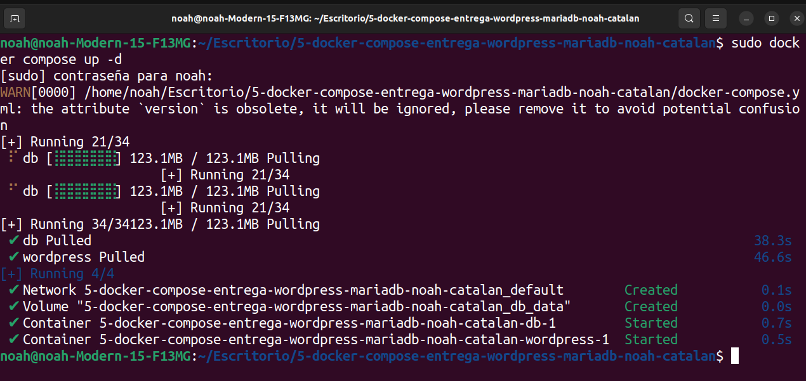
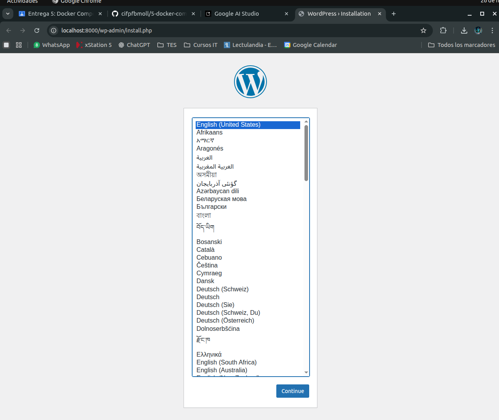
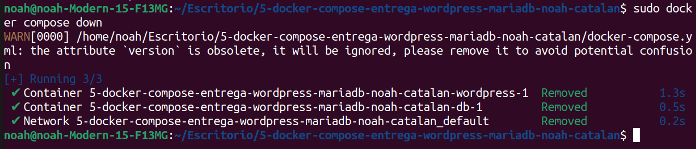
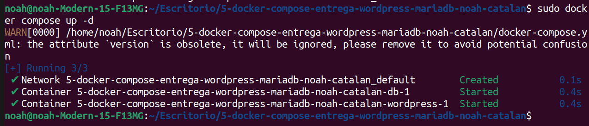

# Wordpress + MariaDB con Docker Compose

## Introducción
En este proyecto ponemos en marcha el CMS Wordpress utilizando Docker Compose. Se despliegan dos contenedores: uno con el servidor web (Apache+PHP+Wordpress) y otro con la base de datos (MariaDB).

## Fichero docker-compose.yml
El contenido del fichero utilizado para la orquestación de los contenedores es el siguiente:

```yaml
version: "3.9"
services:
  db:
    image: mariadb:10.11.2
    volumes:
      - db_data:/var/lib/mysql
    restart: always
    environment:
      MARIADB_ROOT_PASSWORD: somewordpress
      MARIADB_DATABASE: wordpress
      MARIADB_USER: wordpress
      MARIADB_PASSWORD: wordpress
  wordpress:
    depends_on:
      - db
    image: wordpress:latest
    ports:
      - "8000:80"
    restart: always
    environment:
      WORDPRESS_DB_HOST: db:3306
      WORDPRESS_DB_USER: wordpress
      WORDPRESS_DB_PASSWORD: wordpress
      WORDPRESS_DB_NAME: wordpress
volumes:
  db_data:
```

## Paso 1: Puesta en marcha del sistema

Ejecutamos el comando `docker compose up -d` en la terminal. Docker descarga las imágenes necesarias y levanta los servicios en segundo plano.



Una vez finalizado, accedemos a `http://localhost:8000` para comprobar que el servicio está activo, visualizando la pantalla de instalación de Wordpress:



## Paso 2: Parada del sistema

Para detener y eliminar los contenedores utilizamos el comando `docker compose down`. Esto detiene la ejecución, pero mantiene la persistencia de los datos gracias al volumen configurado.



## Paso 3: Re-lanzando el sistema

Volvemos a ejecutar `docker compose up -d`. Al existir ya las imágenes y volúmenes, el proceso es mucho más rápido y simplemente se recrean los contenedores:

